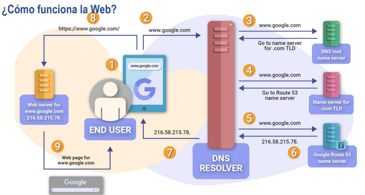
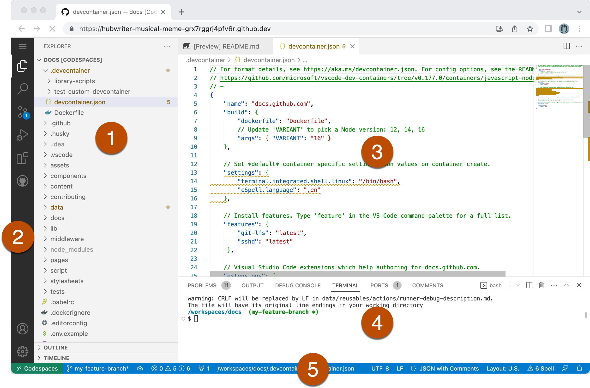
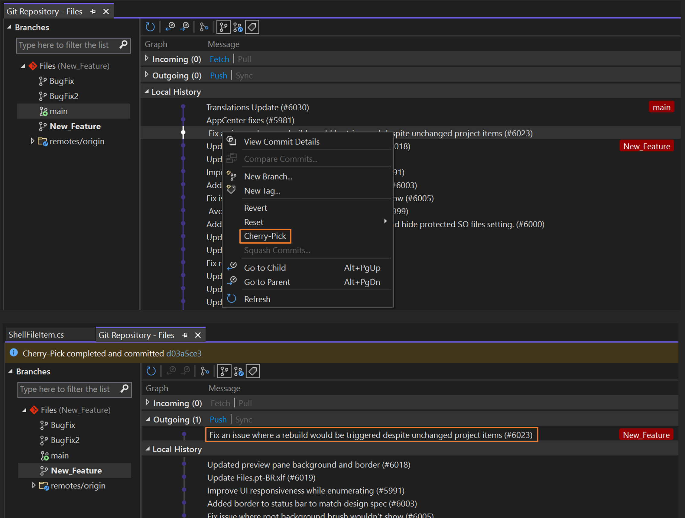

<!-- HEADER con ola animada -->

  

<!-- Título animado con typing -->

  

  
  
  

---

<!-- SECCIÓN 1 -->

  

**Resumen :**  
> Vimos los fundamentos de la tecnología web , su importancia , asi como sus diferentes tipos de uso , además de recibir pautas de los estándares internacionales del desarrollo web 

**Puntos clave**
- Desarrollo frontend
- Desarrollo backend
- Lenguajes de programación como Python, Java,PHP,Node.js
- Bases de datos como MySQL, PostgreSQL, MongoDB

  

<em>Figura 1. Como funciona la Web</em>

<!-- SECCIÓN 2 -->

  

**LABORATORIO 01**
-  Laboratorio 1: Reconocer y utilizar la herramienta de desarrollo integrado Visual Studio Code, áreas de la Pantalla
Principal, y Aplicaciones de la Barra de Menus.

**RESULTADOS**

  

<em>Figura 2. Visual Studio Code</em>

**LABORATORIO 02**
-  Laboratorio 2:  Activación de la Paleta de comandos y ejemplos prácticos del uso de la paleta: Ejemplo de uso de GitHub
Codespaces.

**RESULTADOS**

  

<em>Figura 3. Guia Activación de Paleta</em>

**LABORATORIO 03**
-  Laboratorio 3:  Uso de la Terminal de Visual Studio Code ejemplo práctico de git: git init, git add, git commit, git checkout, git
push. Ramas y merge en github.

**RESULTADOS**

  

<em>Figura 4. Git</em>

**LABORATORIO 04**
-  Laboratorio 4:  Uso de diferentes Keyboard shortcuts en VSC.

**RESULTADOS**
-  Abrir archivo rápido: Ctrl + P

- Nuevo archivo: Ctrl + N

- Abrir carpeta: Ctrl + K Ctrl + O

- Guardar archivo: Ctrl + S

- Guardar todo: Ctrl + K S

- Cerrar archivo actual: Ctrl + W

---

<!-- SECCIÓN 3 -->

  

**¿Qué aprendió?**  
> Aprendí los fundamentos esenciales del desarrollo web, comprendiendo la diferencia y relación entre el frontend y el backend, así como los principales lenguajes de programación que los sustentan. Reconocí la importancia de las bases de datos relacionales y no relacionales en el diseño de aplicaciones modernas y comprendí cómo se aplican los estándares internacionales en el desarrollo web. Además, interioricé la utilidad práctica de Visual Studio Code como entorno de desarrollo, aprovechando su paleta de comandos, terminal integrada, y los atajos de teclado para optimizar mi productividad. También experimenté con Git y GitHub, entendiendo la relevancia del control de versiones y la colaboración en equipo.

**¿Cómo aprendió?**  
> El aprendizaje se dio a través de la combinación de teoría y práctica en laboratorios secuenciales. Primero, exploré el entorno de Visual Studio Code reconociendo cada una de sus secciones; luego, mediante ejercicios prácticos, activé y utilicé la paleta de comandos, lo que me permitió interactuar más rápido con las funciones disponibles. Posteriormente, reforcé el aprendizaje con la terminal, realizando operaciones concretas en Git como init, add, commit, checkout y push, lo cual me ayudó a consolidar el flujo de trabajo con control de versiones. Finalmente, con la práctica de atajos de teclado, descubrí maneras más ágiles de gestionar archivos, moverme entre pestañas y ejecutar tareas, todo de una forma más eficiente.

---

<!-- FOOTER con ola -->

  

