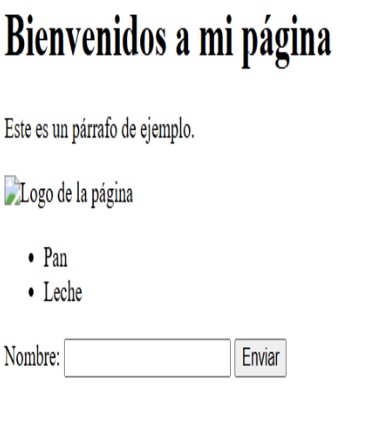

<!-- HEADER con ola animada -->
<p align="center">
  
</p>

<!-- Título animado con typing -->
<p align="center">
  
</p>

<p align="center">
  
  
  
</p>

---

<!-- SECCIÓN 1 -->
<p align="center">
  
</p>

**Resumen :**  
> Como recorre HTML desde básico hasta avanzado: estructura y semántica del documento, contenido (texto, listas, imágenes, enlaces), tablas y formularios; luego multimedia (audio/video), SVG/Canvas, formularios HTML5 con validación, APIs de HTML5 (Drag&Drop, Geolocation, Web Storage), eventos y DOM para interactividad, accesibilidad (WAI-ARIA), microdatos/schema.org y buenas prácticas de SEO. Se apoya en revisión bibliográfica y ejemplos prácticos con código.

**Puntos clave**
- Estructura & Semántica: <!DOCTYPE html>, <head>, <body>; etiquetas semánticas (header/main/section/article/footer) 
- Contenido & Navegación: títulos h1–h6, p, listas ul/ol/li, imágenes con alt, enlaces a con target + rel="noopener noreferrer".
- Datos en Tabla: table/tr/td/th, uso de thead/tbody/tfoot; estilo con CSS (evitar border inline).
- Formularios: form/input/label; tipos HTML5 (email, number, date), required, pattern
- DOM & Eventos: addEventListener, crear/modificar/eliminar nodos, estilos dinámicos.
- Accesibilidad (WAI-ARIA): roles, propiedades y estados; regla de oro: usar primero elementos nativos.


<p align="center">
  
</p>

<p align="center"><em>Figura 1. Creación de HTML básico</em></p>


<!-- SECCIÓN 2 -->
<p align="center">
  
</p>

**LABORATORIO 01**
-  Laboratorio 1: Código referencial  de html avanzado : elemento arrastrable, una zona de soltado, eventos, estilos dinámicos y uso de `DataTransfer`.

**RESULTADOS**
### Código HTML + JS:

```html
<!DOCTYPE html>
<html lang="es">
<head>
  <meta charset="UTF-8">
  <title>Ejemplo Drag and Drop</title>
  <style>
    #dragItem {
      width: 100px;
      padding: 10px;
      background: #88c;
      color: white;
      text-align: center;
      cursor: grab;
      border-radius: 5px;
    }
    #dropZone {
      width: 200px;
      height: 150px;
      border: 2px dashed #555;
      display: flex;
      align-items: center;
      justify-content: center;
      margin-top: 20px;
      transition: 0.3s;
    }
  </style>
</head>
<body>
  <h2>API Drag and Drop en HTML5</h2>

  <p id="dragItem" draggable="true">
    Arrástrame
  </p>

  <div id="dropZone">
    Zona de Drop
  </div>

  <script>
    const dragItem = document.getElementById("dragItem");
    const dropZone = document.getElementById("dropZone");

 
    dragItem.addEventListener("dragstart", (e) => {
  
      e.dataTransfer.setData("text/plain", e.target.id);
      e.dataTransfer.effectAllowed = "move"; 
      e.target.style.opacity = "0.5"; 
    });

    dragItem.addEventListener("dragend", (e) => {
      e.target.style.opacity = "1"; 
    });

   
    dropZone.addEventListener("dragover", (e) => {
      e.preventDefault();
      e.dataTransfer.dropEffect = "move"; 
      dropZone.style.background = "#dfd"; 
    });

    dropZone.addEventListener("dragenter", () => {
      dropZone.style.borderColor = "green";
    });

    dropZone.addEventListener("dragleave", () => {
      dropZone.style.background = "";
      dropZone.style.borderColor = "#555";
    });

    dropZone.addEventListener("drop", (e) => {
      e.preventDefault();
      const id = e.dataTransfer.getData("text"); 
      const draggedElement = document.getElementById(id);
      dropZone.appendChild(draggedElement); 
      dropZone.style.background = "";
      dropZone.style.borderColor = "#555";
    });
  </script>
</body>
</html>

```
**LABORATORIO 02**
-  Laboratorio 2:  HTML avanzado ; La **Geolocation API** permite a las aplicaciones web obtener la **ubicación geográfica del usuario** (latitud, longitud, altitud, velocidad, etc.) siempre que el usuario otorgue permiso[1].

**RESULTADOS**

```html
<button id="btnSeguir">Seguir mi ubicación</button>
<button id="btnDetener">Detener seguimiento</button>
<p id="seguimiento"></p>

<script>
  const salidaSeguimiento = document.getElementById("seguimiento");
  const btnSeguir = document.getElementById("btnSeguir");
  const btnDetener = document.getElementById("btnDetener");
  let watchId; 

  btnSeguir.addEventListener("click", () => {
    if ("geolocation" in navigator) {
      watchId = navigator.geolocation.watchPosition(
        pos => {
          salidaSeguimiento.textContent =
            `Lat: ${pos.coords.latitude}, Lon: ${pos.coords.longitude}`;
        },
        err => {
          salidaSeguimiento.textContent = "Error: " + err.message;
        },
        { enableHighAccuracy: true }
      );
    } else {
      salidaSeguimiento.textContent = "Geolocalización no soportada.";
    }
  });

  btnDetener.addEventListener("click", () => {
    if (watchId) {
      navigator.geolocation.clearWatch(watchId);
      salidaSeguimiento.textContent = "Seguimiento detenido.";
    }
  });
</script>

```

**LABORATORIO 03**
-  Laboratorio 3:  La **Web Storage API** proporciona un mecanismo para que las aplicaciones web almacenen datos de forma estructurada en el navegador mediante **pares clave/valor**. A diferencia de las cookies, no se envían automáticamente en cada petición HTTP, lo que reduce sobrecarga en el tráfico y mejora el rendimiento de la aplicación [1].

| Método | Descripción |
| --- | --- |
| `setItem(clave, valor)` | Almacena un par clave/valor. |
| `getItem(clave)` | Devuelve el valor asociado a la clave. |
| `removeItem(clave)` | Elimina un par clave/valor. |
| `clear()` | Elimina **todos** los datos del almacenamiento. |
| `key(index)` | Retorna la clave en la posición indicada. |
| `length` | Devuelve el número de elementos almacenados. |

## LocalStorage

**RESULTADOS**

```html
<!DOCTYPE html>
<html lang="es">
<head>
  <meta charset="UTF-8">
  <title>Ejemplo LocalStorage</title>
</head>
<body>
  <h2>Ejemplo con localStorage</h2>
  <input id="nombre" placeholder="Escribe tu nombre">
  <button onclick="guardarNombre()">Guardar en localStorage</button>
  <button onclick="mostrarNombre()">Mostrar nombre</button>
  <button onclick="borrarNombre()">Borrar nombre</button>
  
  <p id="resultado"></p>

  <script>
    function guardarNombre() {
      const nombre = document.getElementById("nombre").value;
      localStorage.setItem("usuario", nombre);
      alert("Nombre guardado en localStorage");
    }

    function mostrarNombre() {
      const nombre = localStorage.getItem("usuario");
      document.getElementById("resultado").textContent = 
        nombre ? `Nombre guardado: ${nombre}` : "No hay datos en localStorage";
    }

    function borrarNombre() {
      localStorage.removeItem("usuario");
      alert("Nombre eliminado de localStorage");
    }
  </script>
</body>
</html>

```

## SessionStorage

**RESULTADOS**
```html
<!DOCTYPE html>
<html lang="es">
<head>
  <meta charset="UTF-8">
  <title>Ejemplo SessionStorage</title>
</head>
<body>
  <h2>Ejemplo con sessionStorage</h2>
  <input id="color" placeholder="Escribe tu color favorito">
  <button onclick="guardarColor()">Guardar en sessionStorage</button>
  <button onclick="mostrarColor()">Mostrar color</button>
  <button onclick="borrarColor()">Borrar color</button>
  
  <p id="resultado"></p>

  <script>
    function guardarColor() {
      const color = document.getElementById("color").value;
      sessionStorage.setItem("colorFavorito", color);
      alert("Color guardado en sessionStorage");
    }

    function mostrarColor() {
      const color = sessionStorage.getItem("colorFavorito");
      document.getElementById("resultado").textContent = 
        color ? `Color guardado en esta pestaña: ${color}` : "No hay datos en sessionStorage";
    }

    function borrarColor() {
      sessionStorage.removeItem("colorFavorito");
      alert("Color eliminado de sessionStorage");
    }
  </script>
</body>
</html>

```


---

<!-- SECCIÓN 3 -->
<p align="center">
  
</p>

**¿Qué aprendió?**  
> Aprendí a construir páginas HTML5 válidas y semánticas , asi como insertar y optimizar imágenes , enlaces y  ablas , como crear formularios accesibles con validación HTML5 , integrar multimedia y a usar APIs del navegador (Drag&Drop, Geolocalización, Web Storage), aplicar eventos y manipuar DOM para interactividad

**¿Cómo aprendió?**  
> Fue una exposición realizada por un grupo de trabajo encargaado de la explicación de conceptos de HTML5 ,  en ella nos mencionaron cosas muy importantes y sobretodo las buenas prácticas que uno debe de tener cuando  realiza la programación 

---

<!-- FOOTER con ola -->
<p align="center">
  
</p>
