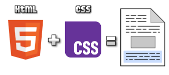
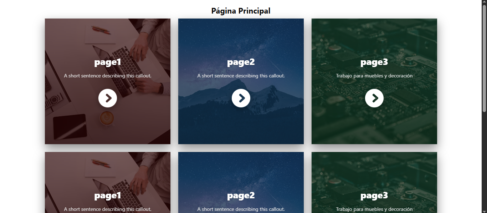
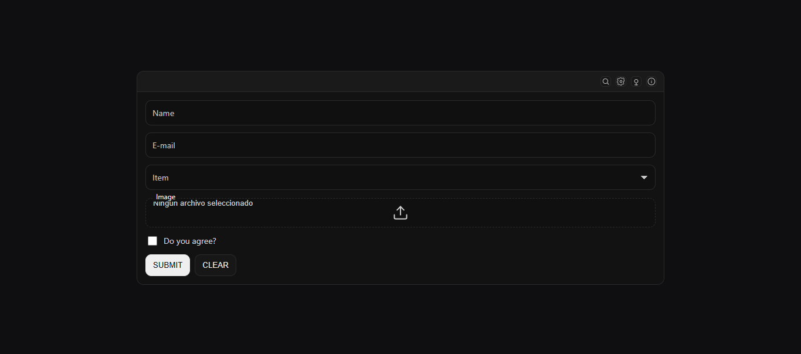
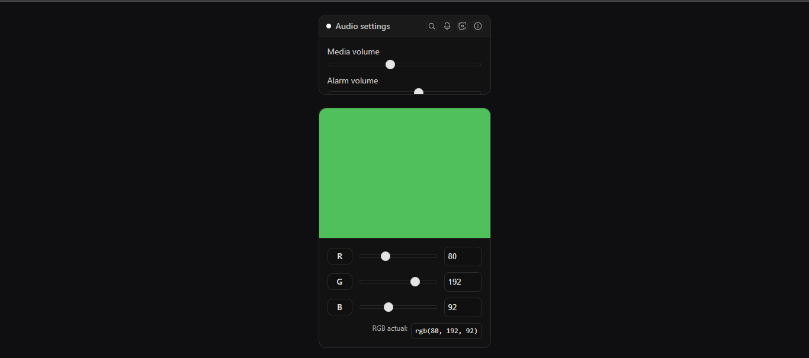
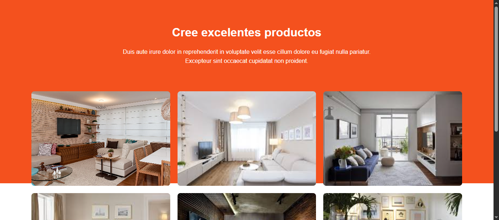

<!-- HEADER con ola animada -->

  

<!-- Título animado con typing -->

  

  
  
  

---

<!-- SECCIÓN 1 -->

  

**Resumen :**  
> El tema de CSS Básico, CSS Avanzado y Bootstrap se centra en comprender cómo dar estilo, estructura y diseño responsivo a páginas web. Se abordaron conceptos esenciales como selectores, modelo de caja, flexbox y grid; técnicas avanzadas como variables, funciones, animaciones y optimización; y finalmente, el uso de Bootstrap para agilizar el desarrollo con componentes y utilidades listas para usar. En conjunto, permiten construir interfaces modernas, adaptables y eficientes.

**Puntos clave**
## CSS BÁSICO
- Selectores y especificidad.
- Modelo de caja.
- Posicionamiento (static, relative, absolute, fixed, sticky).
- Flexbox y Grid para diseño.
- Pseudo-clases y pseudo-elementos.

## CSS AVANZADO
- Variables y funciones (calc(), clamp()).
- Grid y Flexbox avanzados.
- Diseño responsivo (mobile-first, media queries).
- Scroll Snap, Clipping, Masking.
- Optimización de rendimiento.

## BOOTSTRAP
- Sistema de grid responsivo.
- Componentes listos (botones, modales, formularios).
- Clases de utilidad rápidas para espaciado, alineación y colores.
- Personalización con variables CSS/SASS.
- Integración con JS (tooltips, dropdowns, carousels).

  

<em>Figura 1. HTML Y CSS</em>

<!-- SECCIÓN 2 -->

  

**LABORATORIO 01**
-  Desarrollo de un index con html y csss 

**RESULTADOS**

  

<em>Figura 2. Captura de index</em>

**LABORATORIO 02**
-  Desarrollo  de una page01 que incluye 2 actividades

**RESULTADOS**

  

<em>Figura 3. Primer ejercicio de page01</em>

**RESULTADOS**

  

<em>Figura 4. Segundo ejercicio de page01</em>

**LABORATORIO 03**
-  Desarrollo  de una page02 con un diseño atractivo

**RESULTADOS**

  

<em>Figura 5. Ejercicio de page02</em>

---

<!-- SECCIÓN 3 -->

  

**¿Qué aprendió?**  
> Aprendí que CSS no solo sirve para cambiar colores o fuentes, sino que es una herramienta poderosa para estructurar diseños complejos (con flexbox y grid), crear experiencias responsivas (media queries, unidades relativas), y aplicar efectos modernos (scroll snap, filtros, masking). Además, descubrí que Bootstrap facilita mucho el trabajo gracias a sus componentes predefinidos y su sistema de grid que ahorra tiempo en la maquetación.

**¿Cómo aprendió?**  
> Lo aprendí principalmente mediante la exposición de los compañeros en clases, quienes explicaron cada tema con ejemplos prácticos, mostrando tanto el código como los resultados visuales. Esto ayudó a comprender de manera más clara los conceptos y cómo aplicarlos en proyectos reales. La interacción y preguntas también reforzaron el aprendizaje. 

---

<!-- FOOTER con ola -->

  

