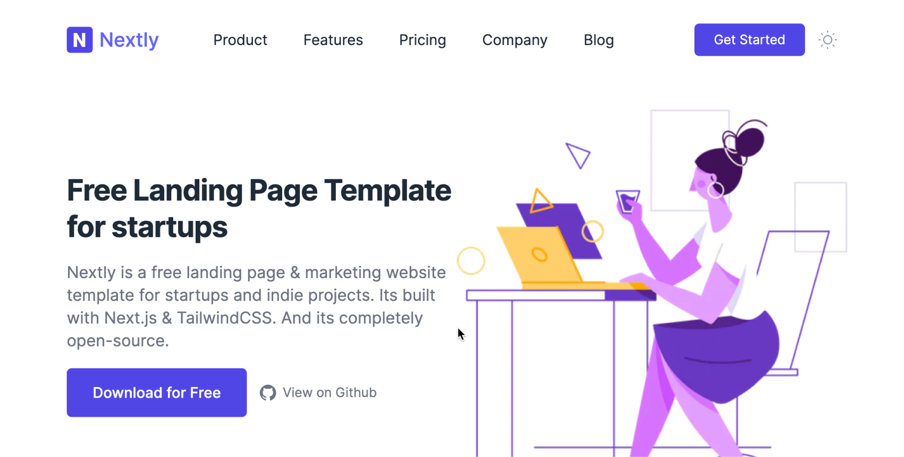
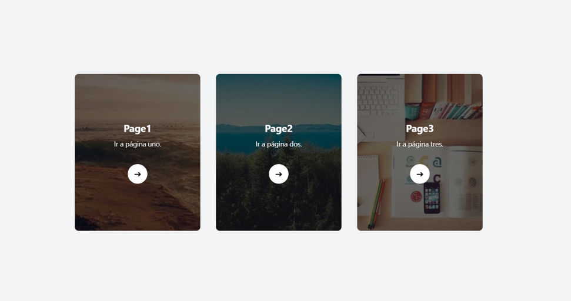
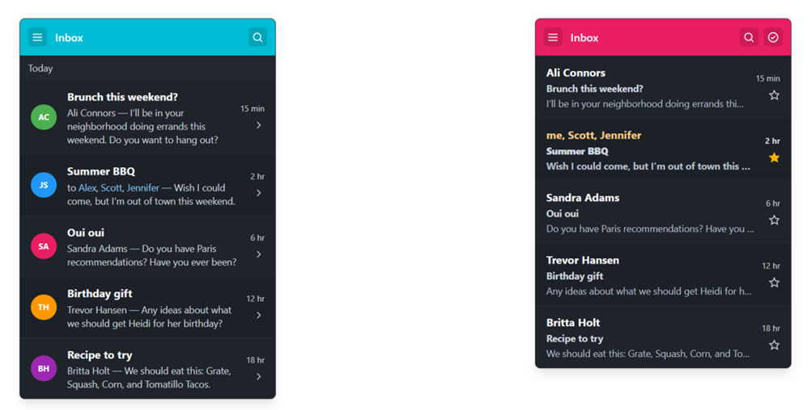
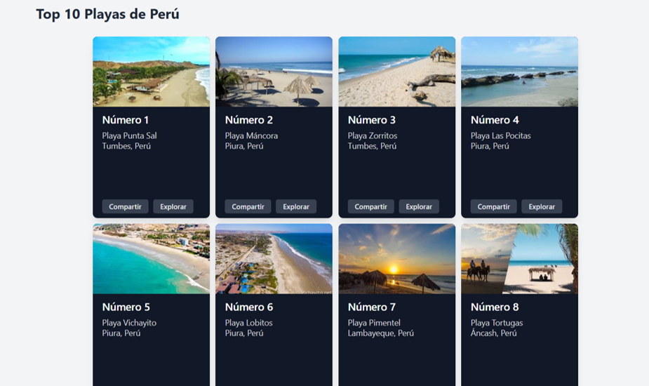
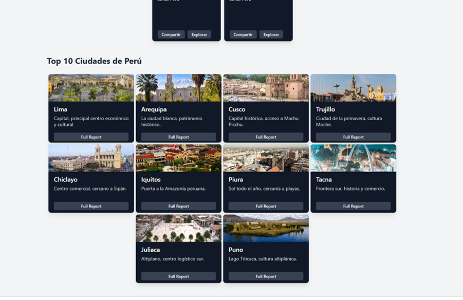
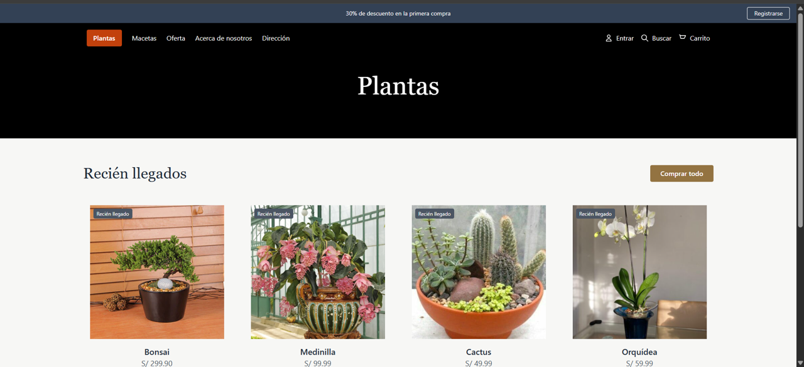

<!-- HEADER con ola animada -->

  

<!-- Título animado con typing -->

  

  
  
  

---

<!-- SECCIÓN 1 -->

  

**Resumen :**  
> En la primera parte se explicó cómo Tailwind CSS permite trabajar con clases utilitarias (Atomic CSS) que simplifican el diseño de interfaces modernas, ofreciendo rapidez y consistencia. Se revisaron aspectos de diseño responsivo con breakpoints (sm, md, lg, xl), la personalización en tailwind.config.js, y cómo manejar espaciados, tipografías y bordes con clases rápidas. También se profundizó en el uso de Flexbox y Grid, la activación del Dark Mode, la optimización con PurgeCSS, así como animaciones, variantes de estado y la integración con frameworks populares como React, Vue o Next.js.

> En la segunda parte, se trató JavaScript básico, desde la introducción al lenguaje y su ejecución en navegadores, hasta el manejo de variables, operadores y estructuras de control como condicionales y bucles. Se exploraron las funciones, la manipulación del DOM, los eventos y el uso de localStorage y sessionStorage. Finalmente, se destacó la importancia de la depuración con la consola y el uso de console.log para identificar errores y entender el flujo del programa

**Puntos clave**
## Tailwind CSS

- Uso de clases utilitarias para construir interfaces rápidas y ordenadas.
- Diseño responsivo con breakpoints.
- Personalización a través de tailwind.config.js.
- Uso práctico de Flexbox, Grid y variantes como hover, focus o active.
- Dark Mode como funcionalidad integrada.
- Animaciones y transiciones sencillas mediante clases (transition, transform).
- Integración con frameworks modernos y optimización con PurgeCSS.

## JavaScript básico

- Tipos de datos y variables (String, Number, Boolean, Array, Object).
- Uso de operadores y estructuras de control (if, else, switch, for, while).
- Funciones para modularizar el código y mejorar la reutilización.
- Manipulación del DOM para interactuar con páginas dinámicas.
- Eventos y escuchadores (addEventListener, onclick).
- Manejo de datos con JSON y almacenamiento local.
- Depuración de errores con la consola del navegador.

  

<em>Figura 1. Como se vería una página web con tailwind y javascript</em>

<!-- SECCIÓN 2 -->

  

**LABORATORIO 01**
-  Laboratorio 1: Un index en donde se puede entrar para poder ver cada uno de las partes que se necesita , en espe caso de la práctica desarrollada en clase

**RESULTADOS**

  

<em>Figura 2. index.html</em>

**LABORATORIO 02**
-  Laboratorio 2:  En page01.html dividida con un grid en 2 columnas y una fila. En la primera columna ubicar
a, y en la segunda ubicar b. Está página es responsiva y cada lista ocupa el 60% de la
columna, si la pantalla es mayor a 1400px. Si es menor a 700px ambas listas ocupan
100%. Si la pantalla es entre 701 y 1399 ocupa el 50%.

**RESULTADOS**

  

<em>Figura 3. page01.html</em>

**LABORATORIO 03**
-  Diseñar un card en html y tailwind con 4 imágenes de 200px y 120px y que contiene
información de las 10 playas más importantes de Perú. Utilice el mismo diseño de la
imagen y recrear todos sus estilos. Los botones share y explore cambia a un color
gris más claro en el evento over, utilice matemáticas para identificar la simetría. Utilice
flexbox para distribuir los 10 card con una separación de 10px

**RESULTADOS**

  

<em>PARTE 1 </em>

-  Diseñar un card en html y tailwind de 250px y 200px que contiene información de las
10 ciudades más importantes de Perú. Utilice el mismo diseño de la imagen y
recrear todos sus estilos. El botón full report cambia a un color gris más claro en el
evento over, utilice matemáticas para identificar la simetría. Utilice flexbox para
distribuir los 10 card con una separación de 5px.

**RESULTADOS**

  

<em>PARTE 2</em>

**LABORATORIO 04**
-  En page03.html.
- a. Diseñar una página web en html y tailwindcon los siguientes elementos de texto,
fondo, colores, imágenes parecidas y exacta distribución.
- b. Cuando sólo se coloca el cursor del mouse sobre alguna imagen este toma una
opacidad del 15% más.
- c. Agregar un diseño responsivo con flexbox y media queries para los tamaños
pequeño<480px, mediano<900px, grande<1200px y extra>1200

**RESULTADOS**

  

<em>PARTE 1 </em>

---

<!-- SECCIÓN 3 -->

  

**¿Qué aprendió?**  
> Aprendí a diseñar interfaces modernas y responsivas usando Tailwind CSS con un enfoque utilitario.
Comprendí la importancia de la configuración personalizada y cómo esto facilita la coherencia en proyectos grandes.
Reconocí la utilidad de Flexbox y Grid para organizar layouts de manera flexible.
Interiorizé los fundamentos de JavaScript como lenguaje central en el desarrollo web, entendiendo cómo se conectan las estructuras de control, funciones y eventos con la interactividad de una página por ultimo 
valoré el uso de herramientas de depuración y almacenamiento local para crear aplicaciones más funcionales y persistentes.

**¿Cómo aprendió?**  
> A través de la exposición en clase, que permitió entender los conceptos mediante explicaciones claras y ejemplos prácticos.

Observando demostraciones en vivo, lo que facilitó relacionar la teoría con la práctica.

Con la participación de los compañeros, resolviendo dudas y comparando enfoques en el uso de Tailwind CSS y JavaScript.

Mediante la discusión grupal, reforzando los temas complejos (como breakpoints, funciones y manipulación del DOM).

Finalmente, aprendió a valorar la integración entre diseño (CSS) y lógica (JS) para construir aplicaciones completas.

---

<!-- FOOTER con ola -->

  

