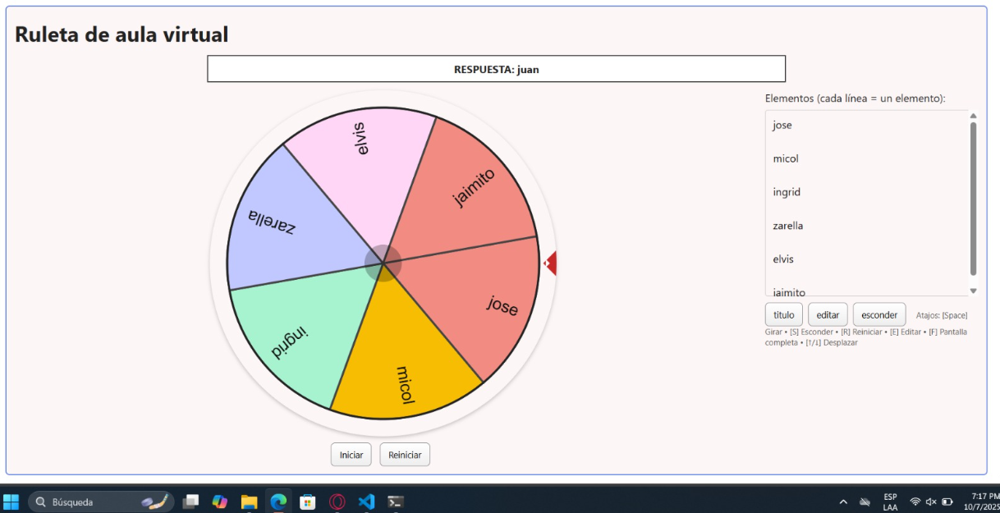
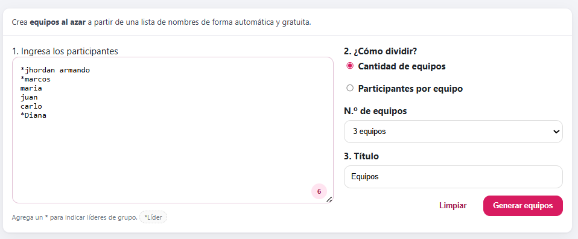
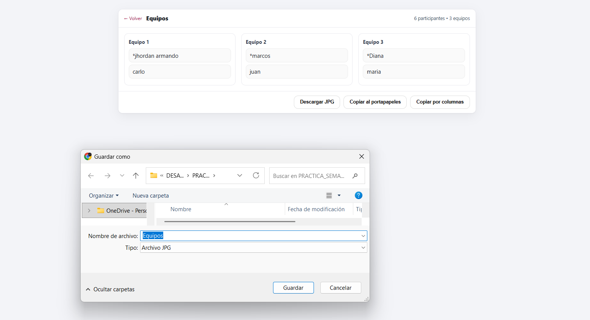

<!-- HEADER con ola animada -->

  

<!-- Título animado con typing -->

  

  
  
  

---

<!-- SECCIÓN 1 -->

  

**Resumen :**  
> Durante la exposición y la práctica de laboratorio se abordaron temas avanzados de JavaScript que incluyen el uso de Canvas para dibujar y animar gráficos en el navegador, la programación orientada a objetos con clases, this y prototype, la manipulación avanzada del DOM para crear y modificar elementos dinámicos, el manejo de la asincronía con Promesas y async/await, el consumo de datos mediante Fetch API y AJAX, la comunicación en tiempo real con WebSockets, el uso de closures y scope para controlar el contexto de ejecución, la gestión de errores con try, catch y throw, y la optimización del rendimiento con Web Workers para ejecutar procesos pesados sin afectar la interfaz.

**Puntos clave**
- Cómo usar getContext("2d") para dibujar y animar en canvas.

- Diferencia entre clases modernas y el antiguo sistema de prototype.

- Crear y modificar elementos HTML de forma dinámica con JS avanzado.

- Comprender la asincronía: promesas, async/await, y su relación con Fetch y llamadas a APIs.

- Manejo de tiempo real con WebSockets (chats, notificaciones instantáneas).

- Importancia de los closures para mantener datos privados y controlar el alcance de variables.

- Cómo manejar errores de forma controlada para evitar bloqueos de la app.

- Uso de Web Workers para tareas pesadas sin congelar la interfaz.

<!-- SECCIÓN 2 -->

  

**LABORATORIO 01**
-  Desarrollar una rule dinámica 

**RESULTADOS**

  

<em>Figura 1. Ruleta dinámica</em>

**LABORATORIO 02**
-  Laboratorio 2:  Desarrollar una app para sortear equipos 

**RESULTADOS**

  

<em>Figura 2. Primera parte</em>

  

<em>Figura 3. Segunda Parte</em>

---

<!-- SECCIÓN 3 -->

  

**¿Qué aprendió?**  
> Aprendí a trabajar con la API de Canvas para crear gráficos y animaciones, a estructurar el código de manera ordenada usando la programación orientada a objetos, a manipular el DOM de forma dinámica para generar interfaces interactivas, a controlar procesos asíncronos usando promesas y async/await, a consumir y mostrar datos de APIs con Fetch y AJAX, a implementar comunicación en tiempo real con WebSockets, a utilizar closures para proteger variables y controlar el alcance, a manejar errores de forma controlada y a mejorar el rendimiento con Web Workers ejecutando tareas en segundo plano.

**¿Cómo aprendió?**  
> Lo aprendí mediante la exposición teórica en clase, donde el docente explicó cada concepto con ejemplos prácticos y casos de uso reales, y reforzándolo en una práctica grupal de laboratorio en la que aplicamos cada tema creando gráficos y animaciones en Canvas, consumiendo datos de APIs, manejando asincronía, probando comunicación en tiempo real, controlando errores y ejecutando procesos pesados en segundo plano sin afectar la experiencia del usuario.

---

<!-- FOOTER con ola -->

  

