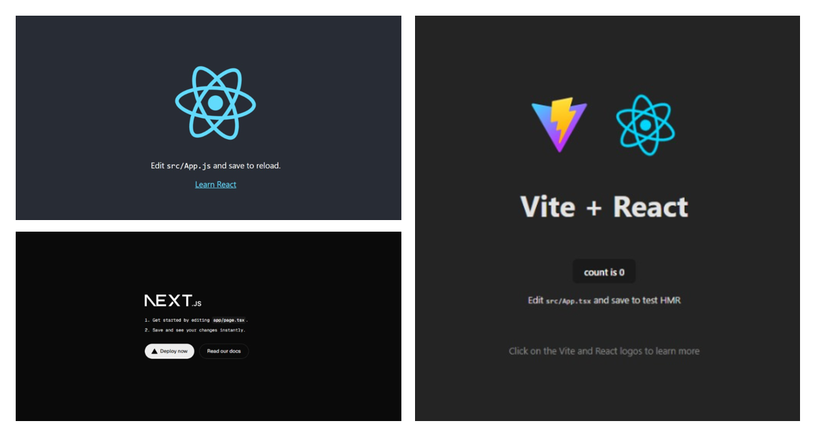
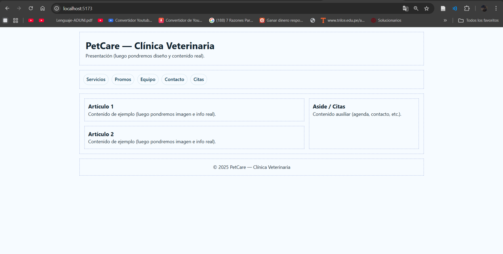
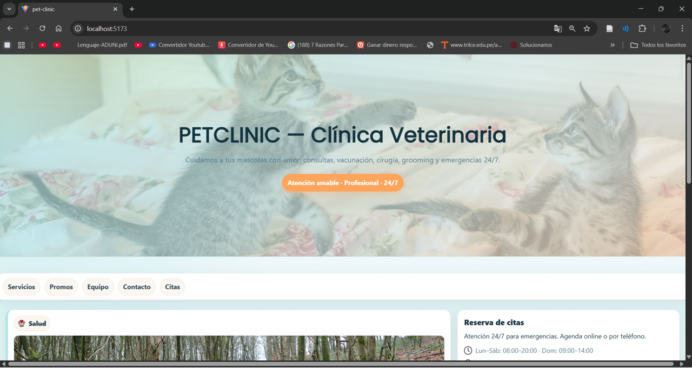
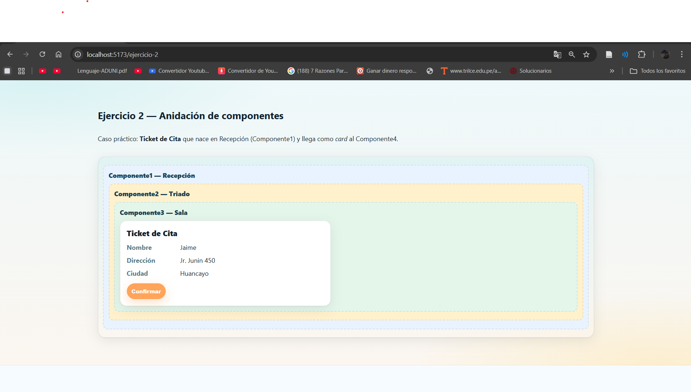
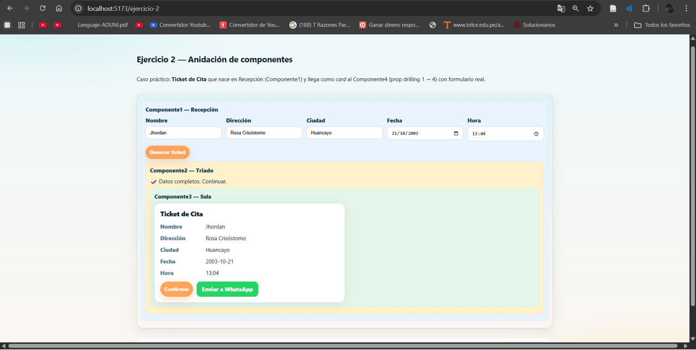
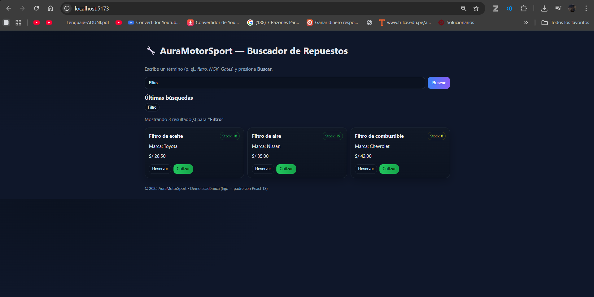
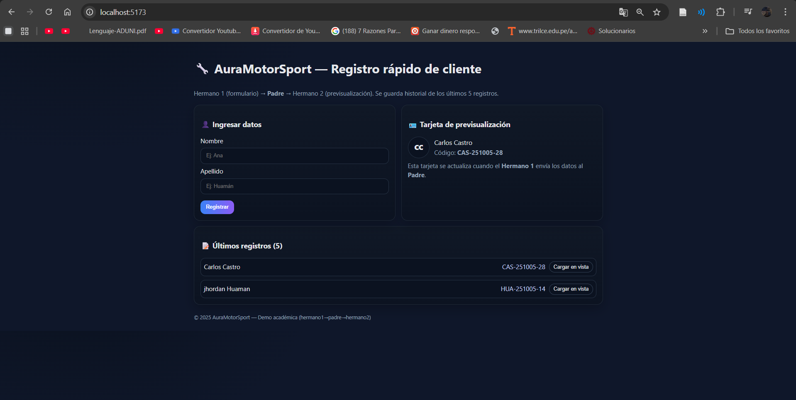
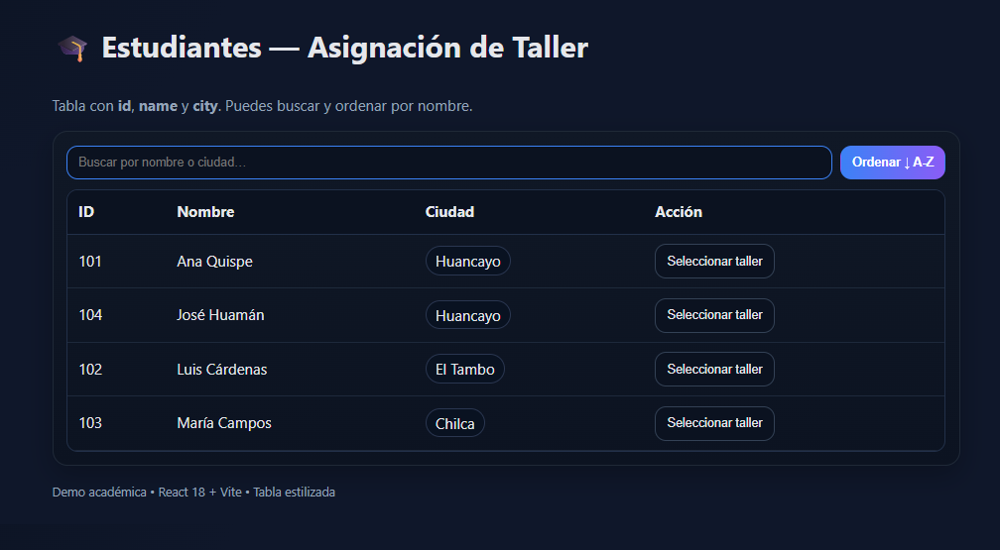
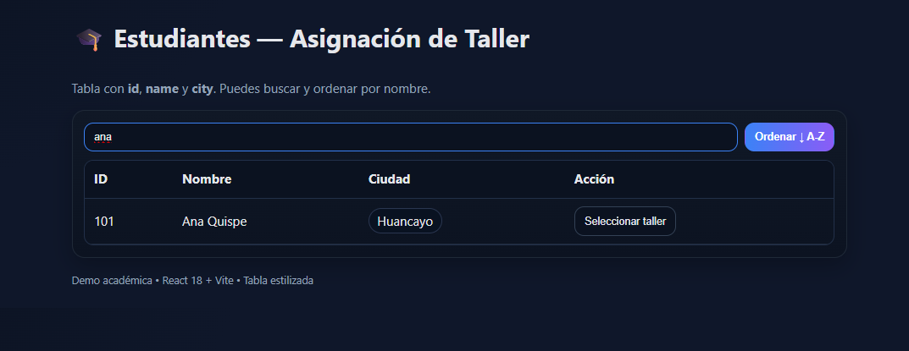

<!-- HEADER con ola animada -->

  

<!-- Título animado con typing -->

  

  
  
  

---

<!-- SECCIÓN 1 -->

  

**Resumen :**  
> Durante esta semana se desarrollo  las diferentes formas de como se puede instalar react e iniciar un proyecto , react es muy importante para el desarrollo de las interfaces y es un lenguage que utiliza tipescript ,  ampliamente utilizado en un montón de proyectos con finalidades empresariales , comercio , deporte , etc  , siendo de lo mejor que se puede aprender para el desarrollo  de aplicaciones web 

**Puntos clave**
- Creación de una plantilla REACT

- Creación de una plantilla REACT Y  NEXT.JS

- Creación de una plantilla REACT Y VITE

- Comprender el funcionamiento de react  en un proyecto y compentrender componentes , dependencias , etc

  

<em>Figura 1. Como se ven proyectos creados con react </em>

<!-- SECCIÓN 2 -->

  

**LABORATORIO 01**
-  Desarrolle una aplicación web en React con un diseño responsivo diferente para pc,
Tablet y móvil considerando la creación de 7 componentes(uno por sección) con diseño
basado en css puro. El diseño inicial para pc es la siguiente.

**RESULTADOS**

  

<em>Figura 2.Estructura Inicial</em>

  

<em>Figura 3.Estructura con estilos</em>

**LABORATORIO 02**
-  Desarrolle una aplicación en React que contenga 4 componentes anidados, es decir el
componente1 contiene al componente 2 hasta el componente 4. Y se desea pasar un
objeto {nombre=”Jaime”, dirección=”Jr. Junin 450”, ciudad=”Huancayo”} desde el
componente 1 al componente 4. Los datos recibidos se visualizará en un card

**RESULTADOS**

  

<em>Figura 4. Inicio</em>

  

<em>Figura 5. Caso Aplicativo</em>

**LABORATORIO 03**
-  Desarrolle una aplicación en React con 2 componentes un componente padre y un hijo,
y pasar datos del componente hijo al padre, y que el dato pueda ser renderizado por el
componente padre.

**RESULTADOS**

  

<em>Figura 6. Componentes</em>

**LABORATORIO 04**
- Desarrolle 3 componentes un componente padre y dos hijos, pasar datos un nombre y
apellido del componente hermano 1 al hermano2.

**RESULTADOS**

  

<em>Figura 7. Patre e hijos</em>

**LABORATORIO 05**
-  Desarrollar componentes en React para renderizar los datos de un objeto de 4
estudiantes id, name y city. Los datos deberán ser presentados en una tabla con estilos
css.
**RESULTADOS**

  

<em>Figura 8. Datos de un objeto</em>

  

<em>Figura 9. Resultado</em>

---

<!-- SECCIÓN 3 -->

  

**¿Qué aprendió?**  
  > Aprendí a realizar una instalación correcta de los diferentes complementos a los que se puede adjuntar react 
**¿Cómo aprendió?**  
> Lo aprendí mediante el desarrollo de la clase , que con ejemplos explicativos y replicando lo estudiado en la sesión 

---

<!-- FOOTER con ola -->

  

