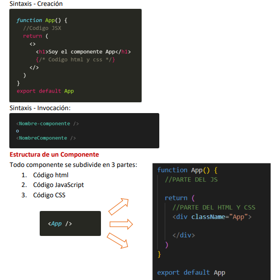
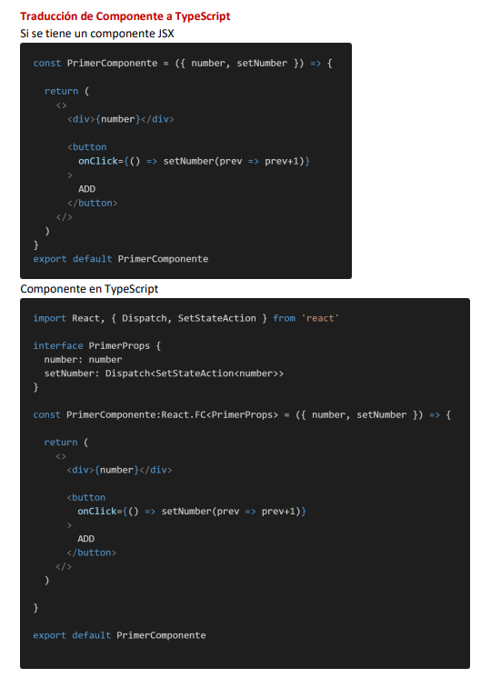

<!-- HEADER con ola animada -->

  

<!-- Título animado con typing -->

  

  
  
  

---

<!-- SECCIÓN 1 -->

  

**Resumen :**  
> Durante la clase de verá  como realizar de manera correcta una anidación de componentes , usando react y vite ,  desde la creación de un proyecto hasta la creación de un Padre y un Hijo 

**Puntos clave**
- ¿como renderiza el DOM React?

- Componenetes en React

- Diseñar Componentes

  

<em>Figura 1. React </em>

<!-- SECCIÓN 2 -->

  

**LABORATORIO 01**
-  Como se desarrolla la creación de componentes

**RESULTADOS**

  

<em>Figura 2.Codigo</em>

**LABORATORIO 02**
-  Como se realiza la tradcción te un componente a .tsx

**RESULTADOS**

  

<em>Figura 3. Componente a Typescript</em>

---

<!-- SECCIÓN 3 -->

  

**¿Qué aprendió?**  
  > Aprendí a realizar una la implementación de componentes asi como la sintaxis clave , esto es fundamnetal para el diseño 
**¿Cómo aprendió?**  
> Lo aprendí mediante el desarrollo de clases , donde se explico paso a paso y con ejemplos prácticos como hacerlo 
---

<!-- FOOTER con ola -->

  

