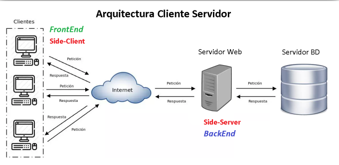
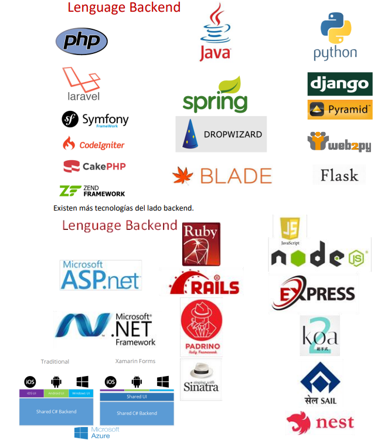
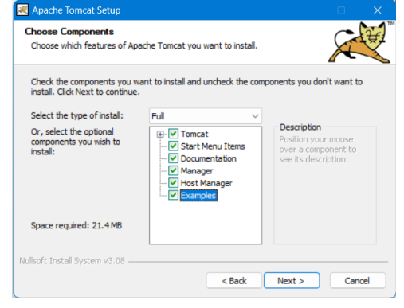

<!-- HEADER con ola animada -->

  

<!-- Título animado con typing -->

  

  
  
  

---

<!-- SECCIÓN 1 -->

  

**Resumen :**  
> Descubrir como es el funcionamiento del backend  , asi como ver la arqitectura cliente - servidor ; distintos tipos de base de datos 

**Puntos clave**
- Backend

- Servidor

- Bases de Datos

  

<em>Figura 1. Arquitectura Cliente - Servidor  </em>

<!-- SECCIÓN 2 -->

  

**LABORATORIO 01**
-  Tecnologías de lado backend 

**RESULTADOS**

  

<em>Figura 2.Backend</em>

**LABORATORIO 02**
-  Tipos de gestores de base de datos 

**RESULTADOS**

  

<em>Figura 3. BD</em>

-  Instalación de apache tomcat

**RESULTADOS**

  

<em>Figura 4. Apache TomCat</em>

-  Desarrollo  de ejercicio practico básico 

**RESULTADOS**

  

<em>Figura 5. Ejercicio01</em>

---

<!-- SECCIÓN 3 -->

  

**¿Qué aprendió?**  
  > Aprendí a realizar correctamente la instalación de el servidor de apache Tompcat especializado para el lenguaje JAVA
**¿Cómo aprendió?**  
> Lo aprendí mediante el desarrollo de clases , siguiento la metodología del docente 
---

<!-- FOOTER con ola -->

  

