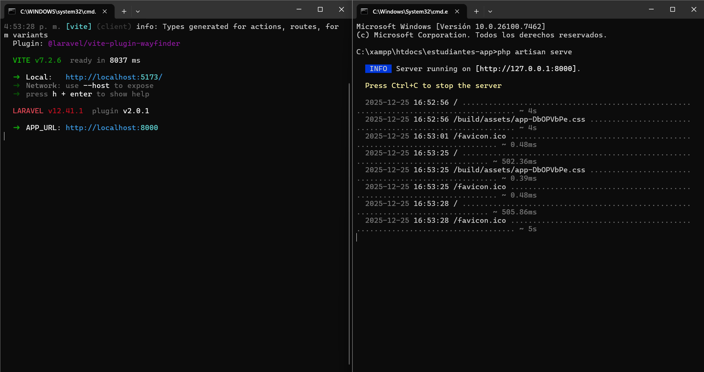
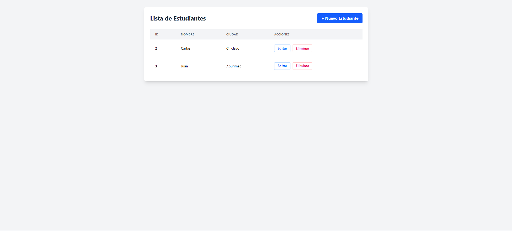
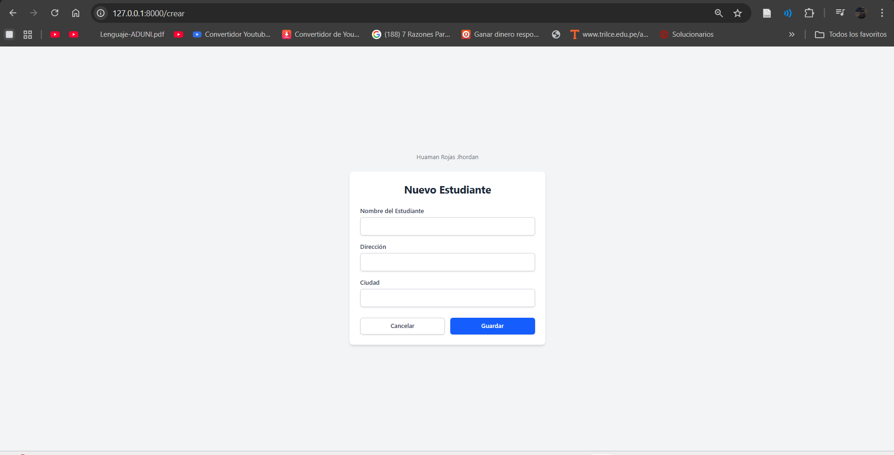

<!-- HEADER con ola animada -->

  

<!-- Título animado con typing -->

  

  
  
  

---

<!-- SECCIÓN 1 -->

  

**Resumen :**  
> Conbinar frontend con backend mediante PHP

**Puntos clave**
- LARAVEL

- REACT

- PHP(php artisan serve)

  

<em>Figura 1. Creación de un proyecto con Laravel </em>

<!-- SECCIÓN 2 -->

  

**LABORATORIO 01**
-  Crear un CRUD de estudiantes que permita agregar , eliminar , listar y  verificar a los estudiantes

**RESULTADOS**

  

<em>Figura 2.Ejecución del código</em>

-  Vista inicial de el programa (CRUD)

**RESULTADOS**

  

<em>Figura 3. Vista inicial</em>

-  Vista de agregado del programa (CRUD)

**RESULTADOS**

  

<em>Figura 3. Agregar estudiante</em>

---

<!-- SECCIÓN 3 -->

  

**¿Qué aprendió?**  
  > Aprendí a desarrollar un crud funcional tanto en el frontend como el backend 
**¿Cómo aprendió?**  
> Lo aprendí en clase mediante una evaluación del docente en cuanto al funcionamiento de una vista con react y laravel
---

<!-- FOOTER con ola -->

  

